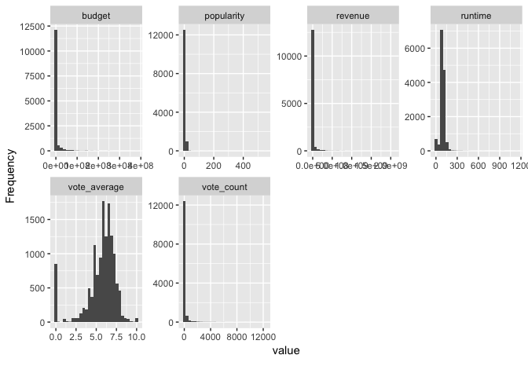
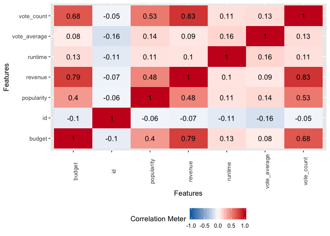
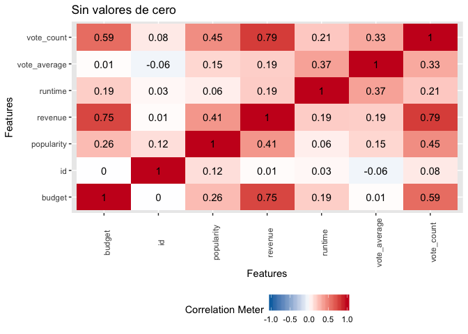
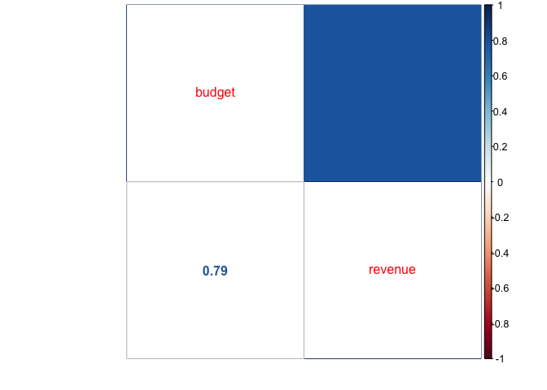
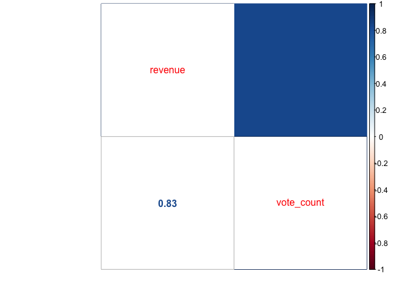
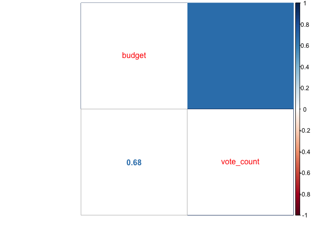

Laboratorio\_10
================
Rodolfo
11/3/2019

# Laboratorio 10

Importacion de librerias.

``` r
library(readr)
library(dplyr)
library(plotly)
library(lubridate)
library(DataExplorer)
library(corrplot)
```

    ## corrplot 0.84 loaded

Leer
archivos

``` r
movies <- read_csv("movies.csv", col_types = "inicfcdfcdicdi") %>% mutate(release_date= mdy(release_date))
```

    ## Warning: Missing column names filled in: 'X1' [1]

    ## Warning: 18 failed to parse.

``` r
ratings <- read_csv("~/Documents/2do Semestre 2019/ratings.csv", col_types = "icidc")
```

    ## Warning: Missing column names filled in: 'X1' [1]

Tipos de datos

``` r
# glimpse(movies)
# glimpse(ratings)
plot_str(movies)
plot_str(ratings)
```

Manipulando data (sin codigo de pelicula no puedo relacionarlas asi que
lo mejor es botar estos datos)

``` r
movies<-drop_columns(movies,"X1")
ratings<-drop_columns(ratings,"X1")
movies <- movies %>% filter(complete.cases(movies))
ratings <- ratings %>% filter(complete.cases(movieId))
```

Resumen de variables numericas

``` r
# Juntas <- full_join(movies, ratings, by= c())
print("Movies:")
```

    ## [1] "Movies:"

``` r
print(summary(split_columns(movies[-2])$continuous))
```

    ##      budget            popularity          revenue         
    ##  Min.   :        0   Min.   :  0.0000   Min.   :0.000e+00  
    ##  1st Qu.:        0   1st Qu.:  0.4025   1st Qu.:0.000e+00  
    ##  Median :        0   Median :  1.1491   Median :0.000e+00  
    ##  Mean   :  4307702   Mean   :  2.9930   Mean   :1.210e+07  
    ##  3rd Qu.:        0   3rd Qu.:  3.6677   3rd Qu.:0.000e+00  
    ##  Max.   :380000000   Max.   :547.4883   Max.   :2.068e+09  
    ##     runtime         vote_average      vote_count     
    ##  Min.   :   0.00   Min.   : 0.000   Min.   :    0.0  
    ##  1st Qu.:  85.00   1st Qu.: 5.000   1st Qu.:    3.0  
    ##  Median :  95.00   Median : 6.000   Median :   10.0  
    ##  Mean   :  94.54   Mean   : 5.624   Mean   :  116.6  
    ##  3rd Qu.: 106.00   3rd Qu.: 6.800   3rd Qu.:   34.0  
    ##  Max.   :1140.00   Max.   :10.000   Max.   :12269.0

``` r
print("Ratings:")
```

    ## [1] "Ratings:"

``` r
print(summary(ratings[c("rating")]))
```

    ##      rating    
    ##  Min.   :0.50  
    ##  1st Qu.:3.00  
    ##  Median :4.00  
    ##  Mean   :3.54  
    ##  3rd Qu.:4.00  
    ##  Max.   :5.00

``` r
plot_histogram(movies[-(2)])
```

<!-- -->

Variables Categoricas y
    Caracteres:

``` r
print("Movies:")
```

    ## [1] "Movies:"

``` r
summary(split_columns(movies)$discrete)
```

    ##    imdb_id          original_language original_title      release_year  
    ##  Length:13548       en     :9624      Length:13548       2014   :  615  
    ##  Class :character   fr     : 699      Class :character   2015   :  568  
    ##  Mode  :character   it     : 459      Mode  :character   2013   :  542  
    ##                     ja     : 414                         2011   :  522  
    ##                     es     : 326                         2009   :  499  
    ##                     de     : 301                         2012   :  498  
    ##                     (Other):1725                         (Other):10304  
    ##   release_date           title          
    ##  Min.   :1969-01-01   Length:13548      
    ##  1st Qu.:1997-01-01   Class :character  
    ##  Median :2008-09-03   Mode  :character  
    ##  Mean   :2009-12-28                     
    ##  3rd Qu.:2015-02-27                     
    ##  Max.   :2068-12-31                     
    ## 

``` r
print("Ratings:")
```

    ## [1] "Ratings:"

``` r
summary(ratings[c("userId", "movieId")])
```

    ##     userId             movieId      
    ##  Length:8164470     Min.   :    11  
    ##  Class :character   1st Qu.:   687  
    ##  Mode  :character   Median :  5503  
    ##                     Mean   : 16822  
    ##                     3rd Qu.: 11316  
    ##                     Max.   :462788

Correlacion de
    variables

``` r
movies %>% plot_correlation()
```

    ## Warning in dummify(data, maxcat = maxcat): Ignored all discrete features
    ## since `maxcat` set to 20 categories!

<!-- -->

``` r
movies %>% filter(budget!=0, revenue!=0) %>% plot_correlation(title = "Sin valores de cero")
```

    ## Warning in dummify(data, maxcat = maxcat): Ignored all discrete features
    ## since `maxcat` set to 20 categories!

<!-- -->

Tres Graficas de
Correlacion

``` r
corrplot.mixed(cor(movies[c("budget", "revenue")]), lower= "number", upper = "col")
```

<!-- -->

``` r
corrplot.mixed(cor(movies[c("revenue", "vote_count")]), lower= "number", upper = "col")
```

<!-- -->

``` r
corrplot.mixed(cor(movies[c("budget", "vote_count")]), lower="number", upper = "col")
```

<!-- -->

Conclusiones: La tabla de ratings no es util mas que para verificacion
pues los datos ya estan resumidos en la tabla
movies.

``` r
ratings %>% filter(movieId==862) %>% summarise(movieId=862,vote_count_generado=n(), vote_average_generado=mean(rating)*2) %>% left_join(movies, by= c("movieId"="id"))
```

    ## # A tibble: 1 x 15
    ##   movieId vote_count_gene… vote_average_ge… budget imdb_id original_langua…
    ##     <dbl>            <int>            <dbl>  <dbl> <chr>   <fct>           
    ## 1     862            66008             7.78 3.00e7 tt0114… en              
    ## # … with 9 more variables: original_title <chr>, popularity <dbl>,
    ## #   release_year <fct>, release_date <date>, revenue <dbl>, runtime <int>,
    ## #   title <chr>, vote_average <dbl>, vote_count <int>

La informacion esta incompleta y esto perjudica en cierta forma el
analisis de los datos como el hecho de que falte informacion sobre
presupuestos y sobre los ingresos.

Hay cierta correlacion con los ingresos y la cantidad de votos y tambien
con el presupuesto y tiene sentido que tambien estos tengan correlacion
entre si y con la popularidad.
