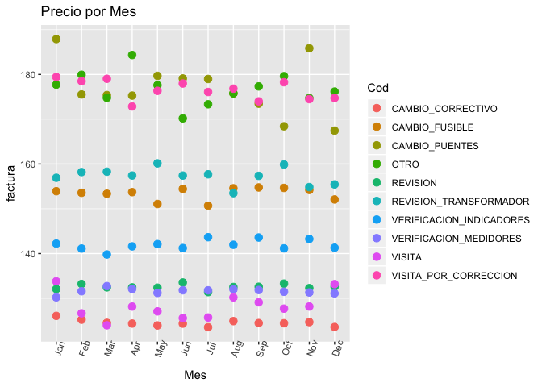
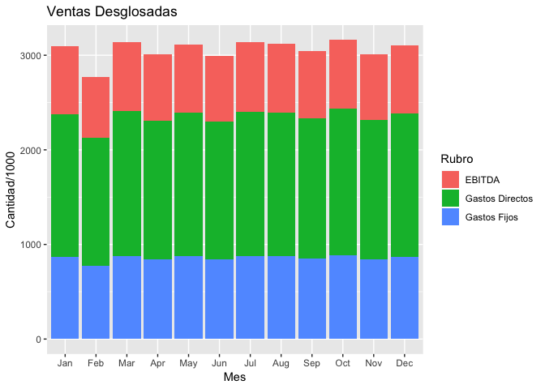
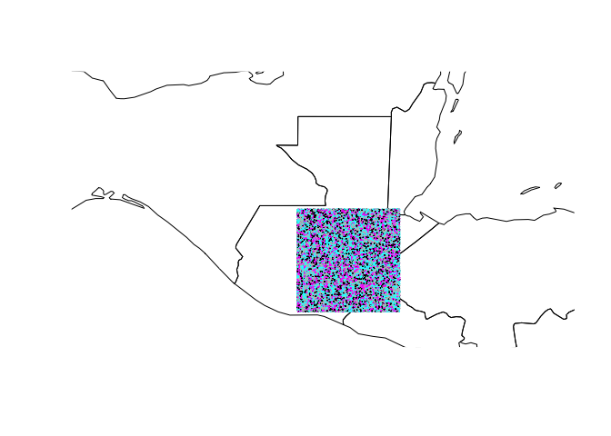
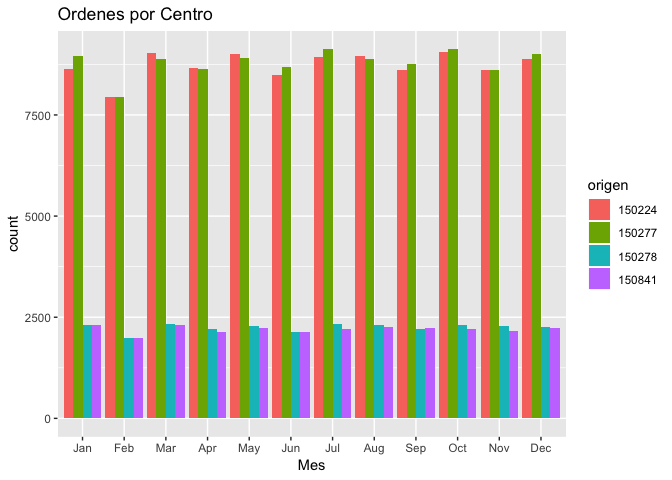

Lab07
================
Rodolfo
22/9/2019

Laboratorio 07
==============

### Rodolfo Rojas

``` r
library(readr)
library(lubridate)
```

    ## 
    ## Attaching package: 'lubridate'

    ## The following object is masked from 'package:base':
    ## 
    ##     date

``` r
library(dplyr)
```

    ## Warning: package 'dplyr' was built under R version 3.5.2

    ## 
    ## Attaching package: 'dplyr'

    ## The following objects are masked from 'package:lubridate':
    ## 
    ##     intersect, setdiff, union

    ## The following objects are masked from 'package:stats':
    ## 
    ##     filter, lag

    ## The following objects are masked from 'package:base':
    ## 
    ##     intersect, setdiff, setequal, union

``` r
library(stringr)
library(tidyr)
library(ggplot2)
#install.packages("rworldmap")
library(rworldmap)
```

    ## Loading required package: sp

    ## ### Welcome to rworldmap ###

    ## For a short introduction type :   vignette('rworldmap')

Cargar y Preparar la data
-------------------------

Cargar la data

``` r
df <- read_csv(file = 'c1.csv') 
```

    ## Warning: Missing column names filled in: 'X23' [23], 'X24' [24],
    ## 'X25' [25], 'X26' [26], 'X27' [27], 'X28' [28]

    ## Parsed with column specification:
    ## cols(
    ##   .default = col_character(),
    ##   ID = col_double(),
    ##   origen = col_double(),
    ##   Lat = col_double(),
    ##   Long = col_double(),
    ##   height = col_double(),
    ##   X23 = col_logical(),
    ##   X24 = col_logical(),
    ##   X25 = col_logical(),
    ##   X26 = col_logical(),
    ##   X27 = col_logical(),
    ##   X28 = col_logical()
    ## )

    ## See spec(...) for full column specifications.

``` r
df <- df %>% select(-X23, -X24, -X25, -X26, -X27, -X28)
```

Formatear la Fecha y colocar el Codigo como factor

``` r
df$Fecha <- dmy(df$Fecha)
df$Cod <- as.factor(df$Cod)
```

Eliminar las Q de lo que es dinero

``` r
Dinero <- c("Camion_5", "Pickup", "Moto", "factura", "directoCamion_5", "directoPickup", "directoMoto", "fijoCamion_5", "fijoPickup", "fijoMoto")
for (x in Dinero) {
  vec<- df %>% pull(x)
  df[,x] <-  str_replace(string = vec ,pattern = "Q-", replacement = "")
  df[,x] <-  str_replace(string = vec ,pattern = "Q", replacement = "")
  df[,x] <- as.numeric(df %>% pull(x))
}
```

    ## Warning: NAs introducidos por coerci'on

    ## Warning: NAs introducidos por coerci'on

    ## Warning: NAs introducidos por coerci'on

    ## Warning: NAs introducidos por coerci'on

    ## Warning: NAs introducidos por coerci'on

    ## Warning: NAs introducidos por coerci'on

    ## Warning: NAs introducidos por coerci'on

    ## Warning: NAs introducidos por coerci'on

    ## Warning: NAs introducidos por coerci'on

Colocar la data en formato Tidy

``` r
df <- gather(df, key= "Vehiculo", value= "Gasto Total", "Camion_5", "Pickup", "Moto", na.rm = TRUE, factor_key = TRUE)
df <- gather(df, key= "V1", value= "Gasto Directo", "directoCamion_5", "directoPickup", "directoMoto", na.rm = TRUE)
df <- gather(df, key= "V2", value= "Gasto Fijo", "fijoCamion_5", "fijoPickup", "fijoMoto", na.rm = TRUE)
df <- gather(df, key = "Duracion", value ="Hi", "5-30", "30-45", "45-75", "75-120", "120+" , na.rm = TRUE, factor_key = TRUE)
df<- df %>% select(-V1, -V2, -Hi)
str(df)
```

    ## Classes 'tbl_df', 'tbl' and 'data.frame':    263725 obs. of  13 variables:
    ##  $ Fecha        : Date, format: "2017-01-16" "2017-06-14" ...
    ##  $ ID           : num  767918 386136 588199 658299 860501 ...
    ##  $ Cod          : Factor w/ 10 levels "CAMBIO_CORRECTIVO",..: 6 5 7 10 10 6 5 5 10 10 ...
    ##  $ origen       : num  150277 150224 150224 150277 150277 ...
    ##  $ Lat          : num  14.8 15.5 14.3 14.3 15.4 ...
    ##  $ Long         : num  -89.3 -90.2 -90.9 -89.7 -89.2 ...
    ##  $ factura      : num  79.3 101.7 118.9 75.7 81.3 ...
    ##  $ height       : num  12 12 14 8 10 8 8 8 10 10 ...
    ##  $ Vehiculo     : Factor w/ 3 levels "Camion_5","Pickup",..: 1 1 1 1 1 1 1 1 1 1 ...
    ##  $ Gasto Total  : num  40.4 34.7 52.9 53.7 46.3 ...
    ##  $ Gasto Directo: num  24.6 20.8 32.8 34.4 31 ...
    ##  $ Gasto Fijo   : num  15.7 13.9 20.1 19.4 15.3 ...
    ##  $ Duracion     : Factor w/ 5 levels "5-30","30-45",..: 1 1 1 1 1 1 1 1 1 1 ...

Generar Estado de Resultados
----------------------------

``` r
ER <- df %>% summarise(Ventas=sum(factura), `Gastos Directos`= -sum(`Gasto Directo`),
                       `Gastos Fijos`= -sum(`Gasto Fijo`), `Gastos Totales`= -sum(`Gasto Total`))
ER <- ER %>% mutate(EBITDA= Ventas- `Gastos Totales`)
ER <- gather(ER, key="Rubro", value = "Cantidad")
ER
```

    ## # A tibble: 5 x 2
    ##   Rubro             Cantidad
    ##   <chr>                <dbl>
    ## 1 Ventas           36688096.
    ## 2 Gastos Directos -17893607.
    ## 3 Gastos Fijos    -10280412 
    ## 4 Gastos Totales  -28174019.
    ## 5 EBITDA           64862116.

Tarifa por Postes
-----------------

``` r
Unitario<- df %>% group_by(ID) %>% summarise(Precio=sum(factura), Costo= sum(`Gasto Total`)) %>% 
  ungroup() %>% summarise(`Precio`=sum(Precio)/n(), Costo= sum(Costo)/n()) 
Unitario
```

    ## # A tibble: 1 x 2
    ##   Precio Costo
    ##    <dbl> <dbl>
    ## 1   494.  380.

Se cobro Q494 por cada poste en la red aproximadamente y el costo por poste es de Q379

``` r
df %>% mutate(Ganancia= factura- `Gasto Total`) %>% 
  group_by( Cod, Mes=month(Fecha, label = TRUE)) %>% summarise(factura=sum(factura)/n())%>% 
  ggplot(aes(x=Mes, y=factura, color=Cod)) + geom_point(size= 3) + labs(title="Precio por Mes") + 
  theme(axis.text.x = element_text(angle = 70))
```



``` r
#ggsave("Precio por Mes.jpg",device = "jpg", path ="graficas")
```

Los precios promedio parecen estar bastante estables lo que indica que los clientes estan de acuerdo con las terifas

Y tampoco estamos en numeros rojos

``` r
 df %>% group_by(Mes=month(Fecha, label = TRUE)) %>% 
  summarise(Ventas=sum(factura), `Gastos Directos`= sum(`Gasto Directo`),
            `Gastos Fijos`= sum(`Gasto Fijo`), `Gastos Totales`= sum(`Gasto Total`),
            EBITDA= sum(factura)-sum(`Gasto Total`)) %>% select(Mes, EBITDA, `Gastos Fijos`, `Gastos Directos`) %>% 
  gather(key= "Rubro", value = "Cantidad", -Mes) %>%  
  ggplot(aes(x=Mes,y=Cantidad/1000, fill=Rubro)) +geom_col(position = "stack")+ labs(title="Ventas Desglosadas")
```



``` r
#ggsave("Ventas Desglosadas.jpg",device = "jpg", path ="graficas")
```

Estos son los servicios que se ofrecen

``` r
df$Cod %>% levels()
```

    ##  [1] "CAMBIO_CORRECTIVO"        "CAMBIO_FUSIBLE"          
    ##  [3] "CAMBIO_PUENTES"           "OTRO"                    
    ##  [5] "REVISION"                 "REVISION_TRANSFORMADOR"  
    ##  [7] "VERIFICACION_INDICADORES" "VERIFICACION_MEDIDORES"  
    ##  [9] "VISITA"                   "VISITA_POR_CORRECCION"

Dias Para el Mantenimiento
--------------------------

``` r
# ID_Unicos <- unique(df$ID)
# Prom_Poste <- c()
# for(x in ID_Unicos){
#   vec<- df %>% filter(ID== x) %>% select(Fecha) %>% arrange(Fecha) %>% pull(Fecha)
#   dias_Poste <- c()
#   if(length(vec)>1){
#     for(j in 1:length(vec)-1){
#       dias_Poste <- c(dias_Poste, vec[j+1]-vec[j]) 
#     }
#     Prom_Poste <- c(Prom_Poste,mean(dias_Poste))
#   }
#   else{
#     Prom_Poste <- c(Prom_Poste,0)
#   }
# }
# Promedio_Mantenimiento <- mean(Prom_Poste)
# Promedio_Mantenimiento
```

En Promedio los Postes necesitan mantenimiento cada 84 dias o 61.5, tomando en cuenta a los que solo se atendieron una vez

Centros de Distribucion
-----------------------

``` r
newmap <- getMap(resolution = "low")
plot(newmap, xlim = c(-91, -90), ylim = c(13.5, 18.5), asp = 1)
points(df$Long, df$Lat, col = df$origen, cex = .06)
```

 Las coordenadas no nos dicen nada, claramente son inventadas

``` r
df %>% group_by(Mes= month(Fecha, label = TRUE), origen=as.factor(origen)) %>% 
  ggplot(aes(x=Mes, fill=origen)) + geom_bar(position = "dodge") + 
  labs(title="Ordenes por Centro")
```



``` r
#ggsave("Ordenes por Centro.jpg", device = "jpg", path ="graficas" )
```

Con esta grafica podemos ver que hay dos centros muy cargados de ordenes y los otros dos no tanto, quiza antes de adquirir mas centros valdria la pena utilizar al maximo los existentes.

#### Ordenes por Vehiculo

``` r
df %>% group_by(origen=as.factor(origen), Vehiculo) %>% 
  count() %>% arrange(origen, n)
```

    ## # A tibble: 12 x 3
    ## # Groups:   origen, Vehiculo [12]
    ##    origen Vehiculo     n
    ##    <fct>  <fct>    <int>
    ##  1 150224 Moto      2433
    ##  2 150224 Camion_5 26497
    ##  3 150224 Pickup   75893
    ##  4 150277 Moto      2622
    ##  5 150277 Camion_5 26492
    ##  6 150277 Pickup   76421
    ##  7 150278 Moto       349
    ##  8 150278 Camion_5  4723
    ##  9 150278 Pickup   21876
    ## 10 150841 Moto       321
    ## 11 150841 Camion_5  4555
    ## 12 150841 Pickup   21543

#### Ordenes por Poste

``` r
df %>% group_by(ID) %>% count(name = "ordenes") %>% arrange(desc(ordenes)) %>% 
  ungroup() %>% select(ID,ordenes) %>% arrange(desc(ordenes))%>% head (15)
```

    ## # A tibble: 15 x 2
    ##        ID ordenes
    ##     <dbl>   <int>
    ##  1 477971     417
    ##  2 863979     338
    ##  3 773607     293
    ##  4 969156     271
    ##  5 337161     257
    ##  6 519948     256
    ##  7 507880     225
    ##  8 353203     192
    ##  9 452252     163
    ## 10 328733     155
    ## 11 873141     150
    ## 12 303615     138
    ## 13 819694     135
    ## 14 314401     131
    ## 15 576391     131

Hay mas de 100 postes a los que se les generaron mas de 50 ordenes, no hay un 80,20 aca
